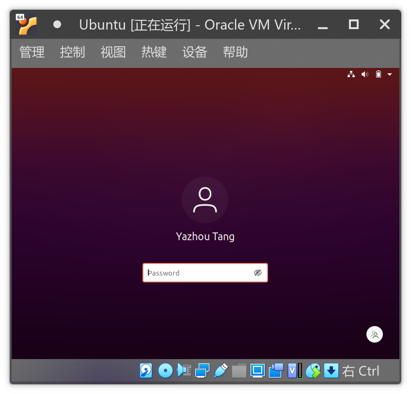
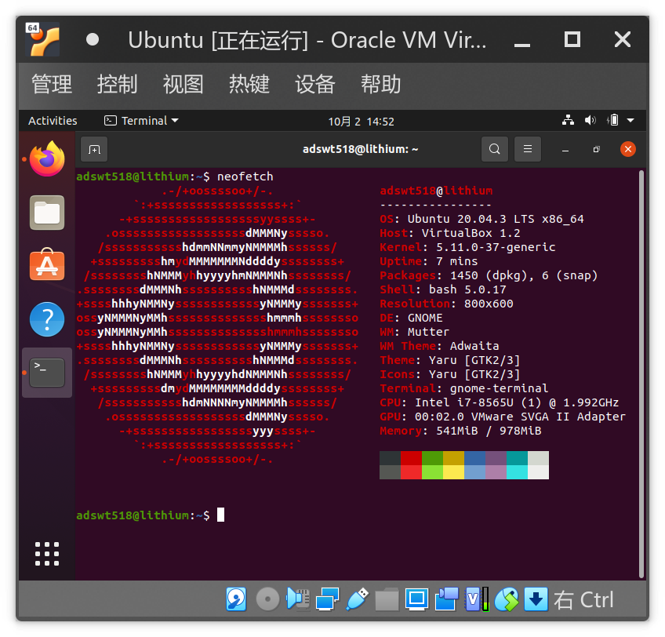

# EI313 Lab1

<center>唐亚周 519021910804</center>

## 基本信息

我的Host系统为ArchLinux，接下来我将在VirtualBox中安装Ubuntu 20.04。

## 安装VirtualBox

参考[ArchWiki上的VirtualBox页面](https://wiki.archlinux.org/title/VirtualBox)，直接使用pacman安装。

```bash
sudo pacman -S virtualbox virtualbox-host-modules-arch
```

## 下载Ubuntu镜像并安装

在[SJTUG软件源镜像服务](https://mirror.sjtu.edu.cn/ubuntu-cd/20.04.3/)下载Ubuntu 20.04的镜像，并导入VirtualBox进行安装。

## 完成截图




