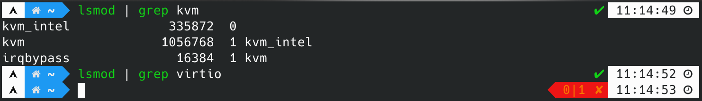
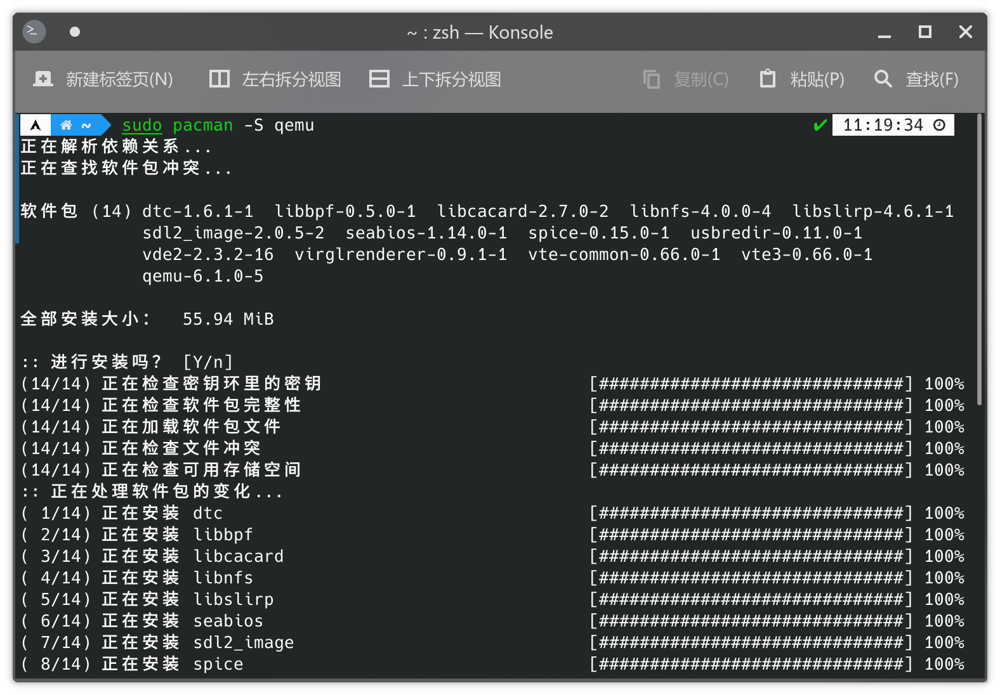
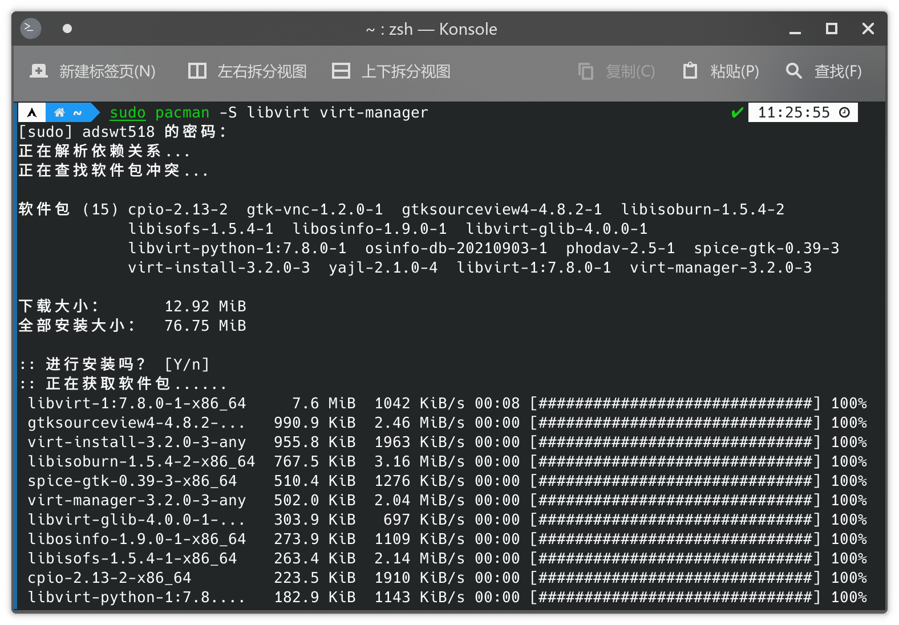
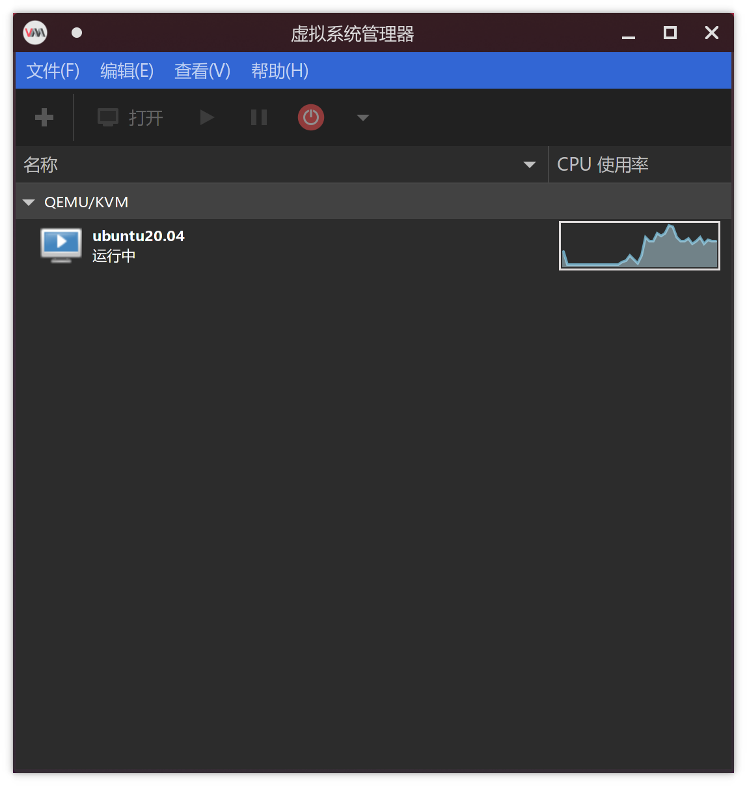
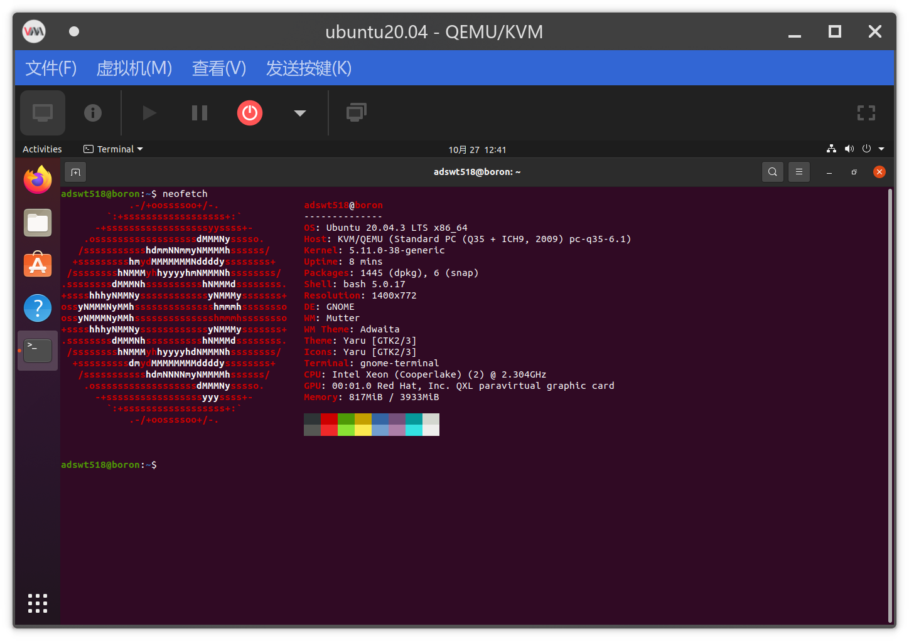

# EI313 Lab2 (试图直接在物理机上配置QEMU但最终失败了)

<center>唐亚周 519021910804</center>

## Download QEMU and compile.

宿主机设备信息：

```
Operating System: Arch Linux
KDE Plasma Version: 5.23.2
KDE Frameworks Version: 5.87.0
Qt Version: 5.15.2
Kernel Version: 5.14.14-arch1-1 (64-bit)
Graphics Platform: X11
Processors: 16 × 11th Gen Intel® Core™ i7-11800H @ 2.30GHz
Memory: 31.1 GiB of RAM
Graphics Processor: Mesa Intel® UHD Graphics
```

### KVM配置[^1][^2]

**KVM**（英文Kernel-based Virtual Machine的缩写）是内核内建的虚拟机。[^3]作为虚拟机时，QEMU可以使用其他虚拟机管理程序（如 Xen 或 KVM）来使用CPU扩展（HVM）进行虚拟化，通过在主机CPU上直接执行客户机代码来获得接近于宿主机的性能。 因此我们首先配置KVM。[^4]

1. 首先检测宿主机的CPU是否支持虚拟化。

   ```bash
   grep -E "(vmx|svm)" --color=always /proc/cpuinfo
   ```

   看到输出，说明支持虚拟化。

2. 然后检查内核是否支持KVM和准虚拟化（Virtio）。

   ```bash
   zgrep CONFIG_KVM /proc/config.gz
   zgrep VIRTIO /proc/config.gz
   ```

   看到输出均为`y`或`m`，说明这两个模块在内核中均可用。

3. 确认这些内核模块是否已自动加载。

   

   说明KVM模块已自动加载，Virtio模块需要手动加载。

4. 手动加载Virtio模块。[^5]

   ```bash
   sudo modprobe virtio
   ```

至此，KVM配置完毕。

### QEMU和图形化界面安装

#### QEMU安装

我使用的是Arch Liunx系统，因此可以直接使用包管理器`pacman`进行安装

```bash
sudo pacman -S qemu
```



然后检测QEMU版本，满足要求。


#### 安装并配置QEMU的图形前端[^2]

与其他的虚拟化程序如 VirtualBox 和 VMware 不同，QEMU不提供管理虚拟机的GUI（运行虚拟机时出现的窗口除外），也不提供创建具有已保存设置的持久虚拟机的方法。[^4]Libvirt提供了一种管理 QEMU 虚拟机的便捷方式，因此我们安装Libvirt及其图形前端。

```bash
sudo pacman -S libvirt virt-manager
```



对于网络连接，还需要安装这些包：

```bash
sudo pacman -S iptables-nft dnsmasq bridge-utils openbsd-netcat
```

然后授权wheel用户组在libvirt中无口令访问读写模式 socket的权限

```bash
sudo vim /etc/polkit-1/rules.d/50-libvirt.rules
```

输入以下内容

```bash
polkit.addRule(function(action, subject) {
    if (action.id == "org.libvirt.unix.manage" &&
        subject.isInGroup("wheel")) {
            return polkit.Result.YES;
    }
});
```

最后启动服务即可

```bash
sudo systemctl enable --now libvirtd.service
```

## Create 2 VMs with TAP mode network (e1000 and virtio-net) by QEMU.

使用`virt-manager`的图形化界面创建Ubuntu 20.04虚拟机并启动，流程与Lab1中虚拟机的安装相似，因此省略。运行时如下图所示。





### VM with TAP mode network e1000

Tap devices是一个Linux内核特性，允许用户创建作为真实网络接口的虚拟网络接口。QEMU可以为虚拟机使用tap网络，因此发送到tap接口的包将被发送到虚拟机，并显示为来自虚拟机中的网络接口。相反，虚拟机通过其网络接口发送的所有内容都将出现在tap接口上。Linux桥接驱动程序支持Tap设备，因此可以将Tap设备彼此桥接在一起，也可以连接其他主机接口，如eth0。[^4]

1. 首先我们手动创建一个bridge，命名为`br0`。
   1. 安装`netctl`
   2. 向
2. 然后创建QEMU用于打开和关闭tap适配器的脚本

### VM with TAP mode network virtio-net

## Connect to your VM through VNC viewer or SSH.

## Compare the network (e1000 and virtio-net) performance of your host machine and VMs.

## 致谢

感谢我的同学陈浩南对我的帮助。

[^1]: 在 Arch 里使用 KVM 装 Arch - 依云's Blog https://blog.lilydjwg.me/2014/7/15/arch-kvm-in-arch.52548.html
[^2]: Archlinux下使用KVM代替Vmware | 老黎即集 https://clixiang.github.io/2018/07/19/linux/using-kvm/
[^3]: KVM - ArchWiki https://wiki.archlinux.org/title/KVM
[^4]: QEMU - ArchWiki https://wiki.archlinux.org/title/QEMU
[^5]: Kernel module - ArchWiki https://wiki.archlinux.org/title/Kernel_module
[^6]: Bridge with netctl - ArchWiki https://wiki.archlinux.org/title/Bridge_with_netctl
[^7]: KVM中的网络简介（qemu-kvm） - 苦咖啡__ - 博客园 https://www.cnblogs.com/wyzhou/p/9634121.html
[^8]: Documentation_Networking - QEMU https://wiki.qemu.org/Documentation/Networking
[^9]:Documentation_Networking_NAT - QEMU https://wiki.qemu.org/Documentation/Networking/NAT
