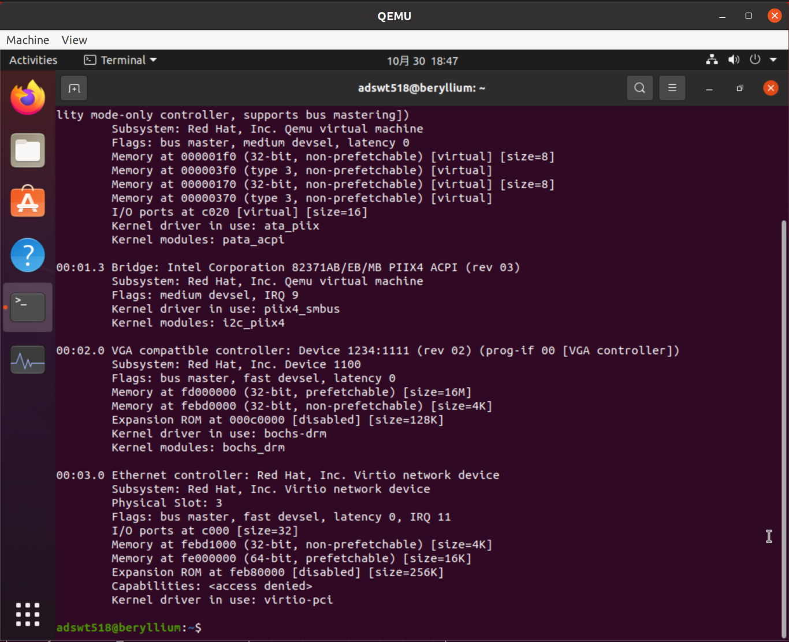
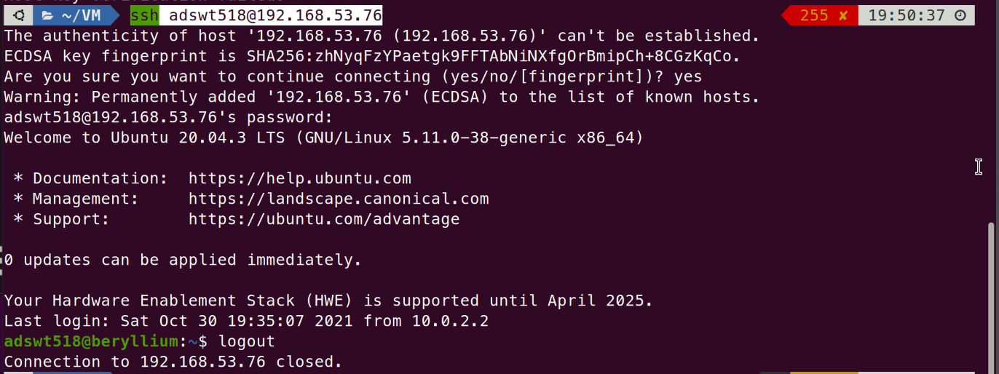

# EI313 Lab2

<center>唐亚周 519021910804</center>

## Download QEMU and compile.

宿主机为VirtualBox中的Ubuntu 20.04 LTS，具体设备信息如下：


### 首先设置硬件支持虚拟化[^1]

首先打开VirtualBox的嵌套虚拟化。在宿主机中输入

```bash
vboxmanage modifyvm "Ubuntu@lithium" --nested-hw-virt on 
```

可以看到嵌套VT-x/AMD-V已打开。


然后在VirtualBox虚拟机中测试


输出结果说明虚拟机的CPU支持虚拟化。

### 下载并编译安装QEMU 5.2.0

1. 首先安装各种依赖库。[^2]

   ```bash
   sudo apt-get install git libglib2.0-dev libfdt-dev libpixman-1-dev zlib1g-dev
   sudo apt-get install git-email
   sudo apt-get install libaio-dev libbluetooth-dev libbrlapi-dev libbz2-dev
   sudo apt-get install libcap-dev libcap-ng-dev libcurl4-gnutls-dev libgtk-3-dev
   sudo apt-get install libibverbs-dev libjpeg8-dev libncurses5-dev libnuma-dev
   sudo apt-get install librbd-dev librdmacm-dev
   sudo apt-get install libsasl2-dev libsdl1.2-dev libseccomp-dev libsnappy-dev libssh2-1-dev
   sudo apt-get install libvde-dev libvdeplug-dev libvte-2.90-dev libxen-dev liblzo2-dev
   sudo apt-get install valgrind xfslibs-dev 
   sudo apt-get install libnfs-dev libiscsi-dev
   ```

2. 然后直接从官网下载源码并解压。

   ```bash
   wget https://download.qemu.org/qemu-5.2.0.tar.xz
   tar xvJf qemu-5.2.0.tar.xz
   ```

3. 配置并编译。注意参数`--target-list=x86_64-softmmu`，代表编译目标为x86_64架构CPU的QEMU，这样可以减少编译所需时间。[^3]

   ```
   cd qemu-5.2.0
   ./configure --enable-kvm --target-list=x86_64-softmmu --enable-debug
   make -j8
   ```

   开始编译：

   

   编译完成：

   

   然后安装：

   

   检测QEMU版本：

   

## Create 2 VMs with TAP mode network (e1000 and virtio-net) by QEMU.

### 创建并安装QEMU虚拟机[^3]

这里我同样选择Ubuntu 20.04 LTS作为QEMU虚拟机的系统。


安装完毕，系统信息如图所示。


### 设置QEMU虚拟机的网络

#### NAT配置[^4]

首先安装必要的库

```bash
sudo apt install bridge-utils iptables dnsmasq
```

然后在`/usr/local/etc`下创建文件`qemu-ifup`，内容如下

```bash
#!/bin/sh
#
# Copyright IBM, Corp. 2010  
#
# Authors:
#  Anthony Liguori <aliguori@us.ibm.com>
#
# This work is licensed under the terms of the GNU GPL, version 2.  See
# the COPYING file in the top-level directory.

# Set to the name of your bridge
BRIDGE=br0

# Network information
NETWORK=192.168.53.0
NETMASK=255.255.255.0
GATEWAY=192.168.53.1
DHCPRANGE=192.168.53.2,192.168.53.254

# Optionally parameters to enable PXE support
TFTPROOT=
BOOTP=

do_brctl() {
    brctl "$@"
}

do_ifconfig() {
    ifconfig "$@"
}

do_dd() {
    dd "$@"
}

do_iptables_restore() {
    iptables-restore "$@"
}

do_dnsmasq() {
    dnsmasq "$@"
}

check_bridge() {
    if do_brctl show | grep "^$1" > /dev/null 2> /dev/null; then
	return 1
    else
	return 0
    fi
}

create_bridge() {
    do_brctl addbr "$1"
    do_brctl stp "$1" off
    do_brctl setfd "$1" 0
    do_ifconfig "$1" "$GATEWAY" netmask "$NETMASK" up
}

enable_ip_forward() {
    echo 1 | do_dd of=/proc/sys/net/ipv4/ip_forward > /dev/null
}

add_filter_rules() {
do_iptables_restore <<EOF
# Generated by iptables-save v1.3.6 on Fri Aug 24 15:20:25 2007
*nat
:PREROUTING ACCEPT [61:9671]
:POSTROUTING ACCEPT [121:7499]
:OUTPUT ACCEPT [132:8691]
-A POSTROUTING -s $NETWORK/$NETMASK -j MASQUERADE 
COMMIT
# Completed on Fri Aug 24 15:20:25 2007
# Generated by iptables-save v1.3.6 on Fri Aug 24 15:20:25 2007
*filter
:INPUT ACCEPT [1453:976046]
:FORWARD ACCEPT [0:0]
:OUTPUT ACCEPT [1605:194911]
-A INPUT -i $BRIDGE -p tcp -m tcp --dport 67 -j ACCEPT 
-A INPUT -i $BRIDGE -p udp -m udp --dport 67 -j ACCEPT 
-A INPUT -i $BRIDGE -p tcp -m tcp --dport 53 -j ACCEPT 
-A INPUT -i $BRIDGE -p udp -m udp --dport 53 -j ACCEPT 
-A FORWARD -i $1 -o $1 -j ACCEPT 
-A FORWARD -s $NETWORK/$NETMASK -i $BRIDGE -j ACCEPT 
-A FORWARD -d $NETWORK/$NETMASK -o $BRIDGE -m state --state RELATED,ESTABLISHED -j ACCEPT 
-A FORWARD -o $BRIDGE -j REJECT --reject-with icmp-port-unreachable 
-A FORWARD -i $BRIDGE -j REJECT --reject-with icmp-port-unreachable 
COMMIT
# Completed on Fri Aug 24 15:20:25 2007
EOF
}

start_dnsmasq() {
    do_dnsmasq \
	--strict-order \
	--except-interface=lo \
	--interface=$BRIDGE \
	--listen-address=$GATEWAY \
	--bind-interfaces \
	--dhcp-range=$DHCPRANGE \
	--conf-file="" \
	--pid-file=/var/run/qemu-dnsmasq-$BRIDGE.pid \
	--dhcp-leasefile=/var/run/qemu-dnsmasq-$BRIDGE.leases \
	--dhcp-no-override \
	${TFTPROOT:+"--enable-tftp"} \
	${TFTPROOT:+"--tftp-root=$TFTPROOT"} \
	${BOOTP:+"--dhcp-boot=$BOOTP"}
}

setup_bridge_nat() {
    if check_bridge "$1" ; then
	create_bridge "$1"
	enable_ip_forward
	add_filter_rules "$1"
	start_dnsmasq "$1"
    fi
}

setup_bridge_vlan() {
    if check_bridge "$1" ; then
	create_bridge "$1"
	start_dnsmasq "$1"
    fi
}

setup_bridge_nat "$BRIDGE"

if test "$1" ; then
    do_ifconfig "$1" 0.0.0.0 up
    do_brctl addif "$BRIDGE" "$1"
fi
```

并设置其权限

```bash
sudo chmod 755 /usr/local/etc/qemu-ifup
```

#### 配置QEMU虚拟机网络

1. VM with TAP mode network e1000

   启动QEMU虚拟机：

   ```bash
   sudo qemu-system-x86_64 -m 4G -drive format=qcow2,file=ubuntu.qcow2 -enable-kvm -net nic,model=e1000 -net tap
   ```

   在虚拟机中查看其网卡信息：

   

   可以看到`Kernel driver in use: e1000`，`Kernel modules: e1000`，说明虚拟机使用e1000网卡。

2. VM with TAP mode network virtio-net

    启动QEMU虚拟机：

   ```bash
   sudo qemu-system-x86_64 -m 4G -drive format=qcow2,file=ubuntu.qcow2 -enable-kvm -net nic,model=virtio-net-pci -net tap
   ```

   在虚拟机中查看其网卡信息：

   

   可以看到`Kernel driver in use: virtio-pci`，说明虚拟机使用virtio驱动。

## Connect to your VM through VNC viewer or SSH.

这里我使用SSH链接QEMU虚拟机。首先启动QEMU虚拟机，并设定端口。[^5]

```bash
sudo qemu-system-x86_64 -m 4G -drive format=qcow2,file=ubuntu.qcow2 -enable-kvm -net nic -net tap -device e1000,netdev=net0 -netdev user,id=net0,hostfwd=tcp::5555-:22
```

然后在VirtualBox虚拟机（相对于QEMU虚拟机来说是宿主机）的终端中输入

```
ssh localhost -p 5555
```

就可以建立宿主机与QEMU虚拟机之间的SSH连接，如图所示。


当然也可以获取QEMU虚拟机的IP地址来进行连接。使用`ifconfig`得到QEMU虚拟机网卡IP地址为`192.168.53.76`。


然后在宿主机中

```bash
ssh adswt518@192.168.53.76
```

就可以连接上了。



## Compare the network (e1000 and virtio-net) performance of your host machine and VMs.

这里我使用iperf进行测试宿主机和QEMU虚拟机之间的网络表现。在QEMU虚拟机的终端中输入`iperf -s -i 1`，在宿主机的终端中输入`iperf -c 192.168.53.76 -t 10 -d`。

1. **e1000下，平均带宽为1.35GB/s。**

   

2. **virtio-net下，平均带宽为2.84GB/s。**

   

可以明显看出，与使用e1000时相比，使用virtio时，QEMU虚拟机的网络性能更好。

## 总结和反思

本次实验中，我首先尝试在物理机的Linux系统中直接安装QEMU并创建虚拟机，但由于我的笔记本电脑只有无线网卡，在设置无线网卡时遇到了一些困难，遂放弃，采用了VirtualBox+QEMU嵌套虚拟化的方法。

本次实验让我对QEMU有了初步的认识，也提高了解决问题的能力。

## 致谢

感谢我的同学陈浩南和刘梓睿对我的帮助，我在与他们的交流中，解决了很多问题。

[^1]:在VirtualBox 6.1里面打开嵌套 VT-x_AMD-V 功能_holderlinzhang的博客-CSDN博客 https://blog.csdn.net/holderlinzhang/article/details/104260531
[^2]:Hosts_Linux - QEMU https://wiki.qemu.org/Hosts/Linux
[^3]:从源码编译安装QEMU以及如何创建QEMU虚拟机_Haifeng的博客-CSDN博客_源码安装qemu https://blog.csdn.net/haifeng_gu/article/details/108055083
[^4]:Documentation_Networking_NAT - QEMU https://wiki.qemu.org/Documentation/Networking/NAT
[^5]: Documentation_Networking - QEMU https://wiki.qemu.org/Documentation/Networking
