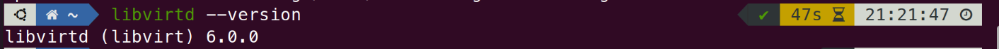
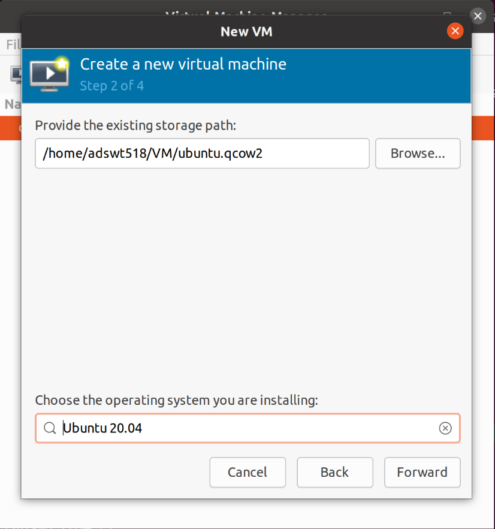
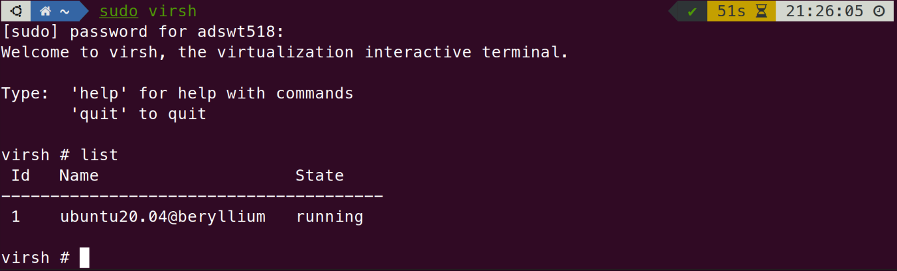
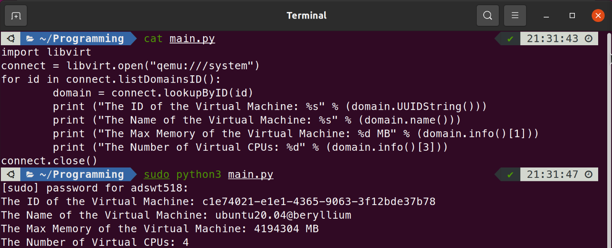

# EI313 Lab3

<center>唐亚周 519021910804</center>

## Install Libvirt

### 相关包的安装

我首先尝试了直接编译Libvirt源码进行安装，但遇到了各种问题，最终决定直接使用包管理器安装。注意这里会同时安装apt仓库中的qemu，但与我们之前编译安装的qemu并不冲突。

```bash
sudo apt install libvirt-daemon-system libvirt-clients bridge-utils virtinst virt-manager
```

检测是否安装成功：



### 原虚拟机的迁移

在上一个lab中，我们使用命令行以`.qcow2`文件的形式直接创建了一个qemu虚拟机，在这里我们需要将其安装在virt-manager中。首先我们启动virt-manager

```bash
sudo virt-manager
```

接着选择从已存在的磁盘映像中导入虚拟机。


然后选择上一个lab中创建的`.qcow2`文件，并选择正确的操作系统。



之后再配置虚拟机的CPU和内存。这里CPU设置为4核，内存设置为4GB。


最后设置好虚拟机的名字就能够成功安装并启动了。然后我们使用virsh来检查虚拟机。



可以看到刚刚安装的虚拟机，说明迁移成功。

## Write script to get virtual machine information

首先编写Python代码如下：

```python
import libvirt
connect = libvirt.open("qemu:///system")
for id in connect.listDomainsID():
	domain = connect.lookupByID(id)
	print ("The ID of the Virtual Machine: %s" % (domain.UUIDString()))
	print ("The Name of the Virtual Machine: %s" % (domain.name()))  
	print ("The Max Memory of the Virtual Machine: %d MB" % (domain.info()[1]))
	print ("The Number of Virtual CPUs: %d" % (domain.info()[3]))
connect.close()
```

然后以超级用户权限运行代码，得到输出结果如下：



这样就得到了虚拟机的ID、名称、最大内存和CPU数量，与安装时的配置进行对比，完全正确。

## 致谢

感谢我的同学刘梓睿在本次实验中对我的帮助。
