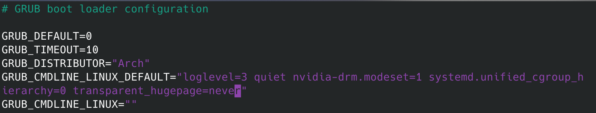
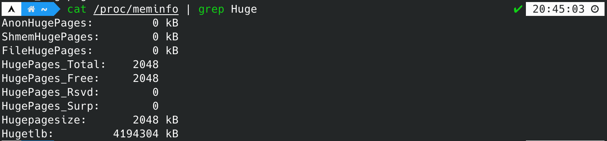
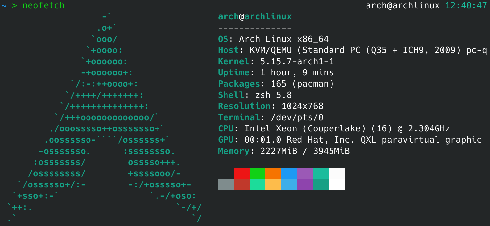
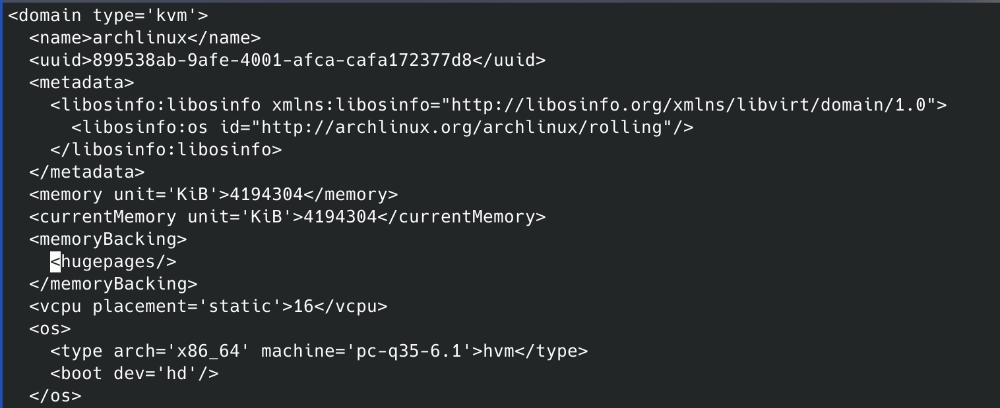
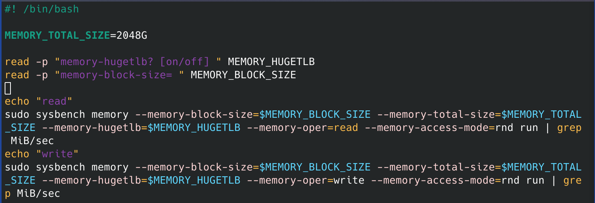
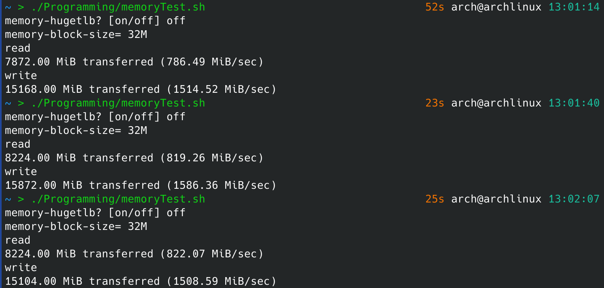
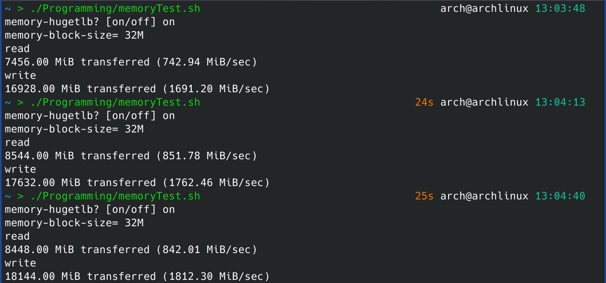
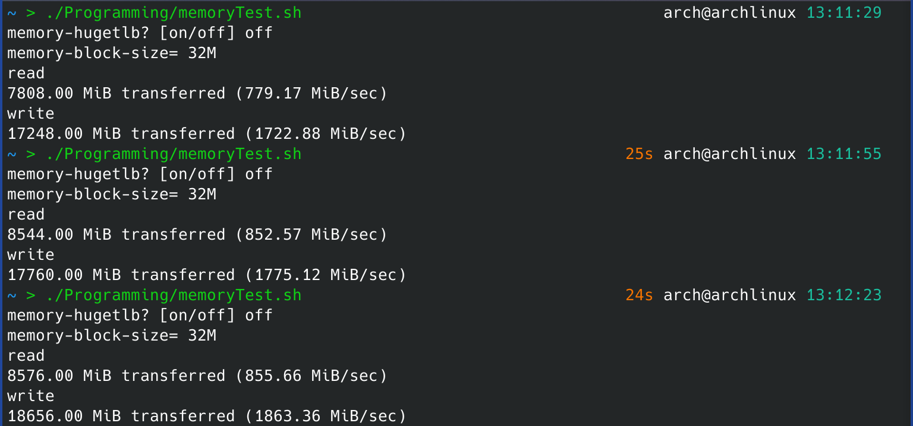
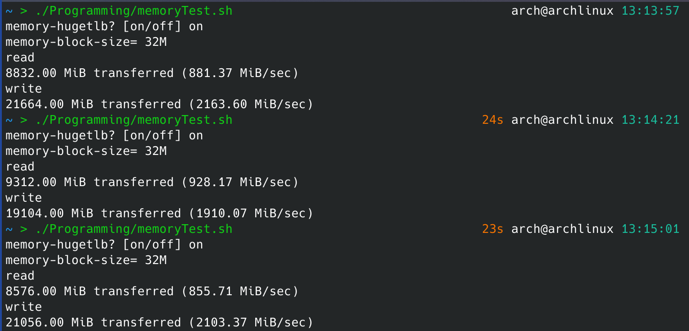

# EI313 Lab4

<center>唐亚周 519021910804</center>

在本次实验中，为了使实验效果更为显著，我选择了在物理机上直接运行qemu虚拟机，从而避免嵌套虚拟化带来的性能损耗。

## 在宿主机上开启Hugepage功能[^1][^2]

> (1) Prepare 2MB or 1GB hugepages on your host server. Present your hugepage configure (e.g. /proc/meminfo).
>
> // Note: If the OS supports transparent huge page, disable it when you do the tests.
>

首先将transparent hugepage关闭，即在`/etc/default/grub`中的`GRUB_CMDLINE_LINUX_DEFAULT`选项中添加`transparent_hugepage=never`，如下图所示，并重新生成grub配置然后重启。



检查transparent hugepage情况，输出如下，表示transparent hugepage已被关闭。


然后启用Hugepage。首先检测每个Hugepage的大小。


每个Hugepage大小为2MB，由于预计分配给QEMU虚拟机的内存大小为4GB，这里我打算分配总大小4GB的Hugepage。因此是创建文件`/etc/sysctl.d/40-hugepage.conf`并写入`vm.nr_hugepages=2048`，设置了2048个大小为2MB的Hugepage。然后重启，检查Hugepage情况。



可以看到Hugepage启用成功。

## 配置虚拟机，并设置其使用/不使用Hugepage[^1][^2]

> (2) Create a QEMU KVM virtual machine using hugepages on the host.
>
> (3) Create another QEMU KVM VM without hugepages.

在这里我们直接下载https://mirror.sjtu.edu.cn/archlinux/images/latest/中的archLinux镜像，并使用virt-manager进行安装，然后使用ssh连接虚拟机方便测试。虚拟机信息如下。



要使虚拟机使用宿主机的Hugepage，只需要在编辑虚拟机对应的xml文件。我们在宿主机中输入以下命令进行编辑。

```bash
sudo virsh edit archlinux
```

写入以下几行：

```xml
<memoryBacking>
<hugepages/>
</memoryBacking>
```

编辑后的文件如下图所示（截取部分）：



要使虚拟机不使用宿主机的Hugepage，则将这几行删去即可。

## 在虚拟机中开启Hugege并安装测试所用软件

> (4) In both VMs allocate and use hugepages or not.

方法与宿主机中完全相同。在虚拟机中启动了1024个大小为2MB的Hugepage。


安装sysbench：

```bash
sudo pacman -S sysbench
```

## 进行内存测试

> (5) Run memory instensive benchmark (e.g. sysbench memory test, in-memory database) on two VMs and record the performance.

这里我使用sysbench进行测试，首先编写测试脚本如下：



其中，

* `--memory-block-size`选项代表了测试内存块的大小，这里我将其设置为测试时输入，方便找出较好的测试内存块大小。
* `--memory-total-size`选项代表了传输数据的总大小，这里我将其设置为`2048G`。
* `--memory-hugetlb`选项决定了测试时虚拟机是否启用Hugepage，这里我将其设置为测试时输入。
* `--memory-oper`选项决定了测试的方式，这里我先测试内存读取，再测试内存写入。
* `--memory-access-mode`选项代表了测试时的存取方式，这里我将其设置为`rnd`，代表随机读写。

接下来开始测试。由于默认的内存页大小为4kB，而Hugepage大小为2048kB，测试内存块的大小应该设置得大一些，从而凸显出二者的差别。经过测试，我发现当测试内存块的大小设置为32MB时，效果较好。

### 宿主机不启用Hugepage，虚拟机不启用Hugepage



三次测试，平均读取速率为809.27MiB/s，平均写入速率为1536.49MiB/s。

### 宿主机不启用Hugepage，虚拟机启用Hugepage



三次测试，平均读取速率为812.24MiB/s，平均写入速率为1755.32MiB/s。

### 宿主机启用Hugepage，虚拟机不启用Hugepage



三次测试，平均读取速率为829.13MiB/s，平均写入速率为1787.12MiB/s。

### 宿主机启用Hugepage，虚拟机启用Hugepage



三次测试，平均读取速率为888.42MiB/s，平均写入速率为2059.01MiB/s。

## 结论与分析

> (6) Compare the result and try to give some explanation.

### 测试结果

测试结果如下：

内存读取速度：

|                          | 虚拟机不启用Hugepage | 虚拟机启用Hugepage |
| ------------------------ | -------------------- | ------------------ |
| **宿主机不启用Hugepage** | 809.27MiB/s          | 812.24MiB/s        |
| **宿主机启用Hugepage**   | 829.13MiB/s          | 888.42MiB/s        |

内存写入速度：

|                          | 虚拟机不启用Hugepage | 虚拟机启用Hugepage |
| ------------------------ | -------------------- | ------------------ |
| **宿主机不启用Hugepage** | 1536.49MiB/s         | 1755.32MiB/s       |
| **宿主机启用Hugepage**   | 1787.12MiB/s         | 2059.01MiB/s       |

可以看出，无论是宿主机还是虚拟机，启用Hugepage都会对内存的随机写入性能带来一定提升。当二者均启用Hugepage时，其内存读取速率要比均不启用时高出9.8%，内存写入速率要比均不启用时高出34.0%。

### 分析

经过查阅资料[^3][^4][^5]，我认为Hugepage给内存性能带来提升，主要有以下几个原因。

* 使用Hugepage可以减少内存中的页表层级。这不仅可以降低页表的内存占用，也能降低从虚拟内存到物理内存转换的性能损耗。
* Hugepage能降低TLB（Translation lookaside buffer）的压力，在相同的内存大小情况下使得需要管理的虚拟地址数量变少，因此TLB可以包含更多的地址空间，从而带来更高的缓存命中率，CPU 有更高的几率可以直接在 TLB中获取对应的物理地址。
* 使用Hugepage可以减少获取大内存的次数，使用 HugePages 每次可以获取 2MB 的内存，是 4KB 的默认页效率的 512 倍。

## 致谢

感谢我的同学秦健行、卿云帆、陈浩南、刘梓睿和蒋圩淏在本次实验中对我的帮助！在与他们的交流和讨论中我解决了许多困难，并学到了很多。

[^1]:[KVM - ArchWiki](https://wiki.archlinux.org/title/KVM#Enabling_huge_pages)
[^2]:[KVM - Using Hugepages - Community Help Wiki](https://help.ubuntu.com/community/KVM%20-%20Using%20Hugepages)
[^3]:[为什么 HugePages 可以提升数据库性能 - 面向信仰编程](https://draveness.me/whys-the-design-linux-hugepages/)
[^4]:[Linux 中的“大内存页”（hugepage）是个什么？ - 知乎](https://zhuanlan.zhihu.com/p/34659353)
[^5]:[Linux HugePage 特性_乐沙弥的世界-CSDN博客_hugepage](https://blog.csdn.net/leshami/article/details/8777639)
