# EI313 Lab5

<center>唐亚周 519021910804</center>

DPDK performance test.

## 配置虚拟机

> (1) Create two virtual machines on KVM.

这里我继续使用Lab4中配置的虚拟机，并在宿主机上使用ssh连接虚拟机，从而方便实验的进行。虚拟机信息如下：

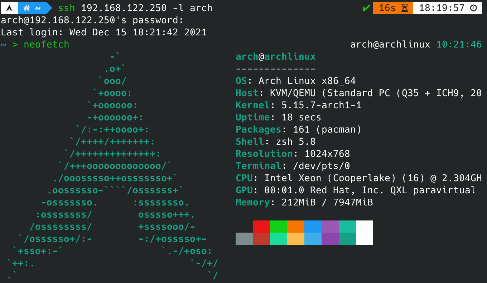

## 配置DPDK

> (2) Compile and install DPDK library on each virtual machine.
>

### 编译安装[^1]

首先安装依赖的包。

```bash
sudo pacman -S wget meson gcc python-pyelftools
```

下载最新版DPDK：

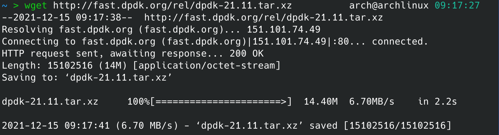

进入DPDK所在文件夹，输入以下命令进行编译安装。这里同时编译安装了l2fwd样例程序。

```bash
meson -Dexamples=l2fwd build
cd build
ninja
sudo ninja install
sudo ldconfig
```

等待安装完成：

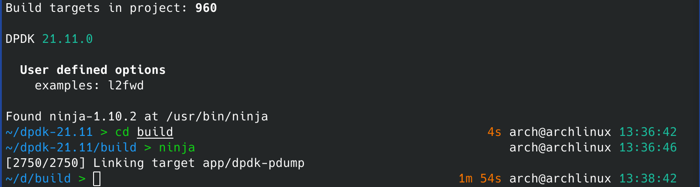

### 配置

#### Hugepage配置

在lab4中配置过Hugepage，因此不再赘述，具体信息如下：

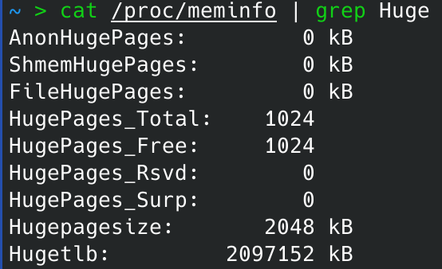

#### 网卡驱动绑定[^2]

由于我在尝试使用VFIO作为驱动时，一直绑定失败，并且没能找到解决方案，我选择UIO来重新进行尝试。[^3]

首先编辑grub配置文件，在内核启动参数上加上`intel_iommu=off`以禁用IOMMU。

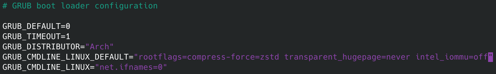

然后重新生成grub配置，并重启。

```bash
sudo grub-mkconfig -o /boot/grub/grub.cfg
```

注意，由于用于绑定的网卡必须处于关闭状态，考虑到虚拟机的网络连接需求，我使用virt-manager加入了两张虚拟网卡。

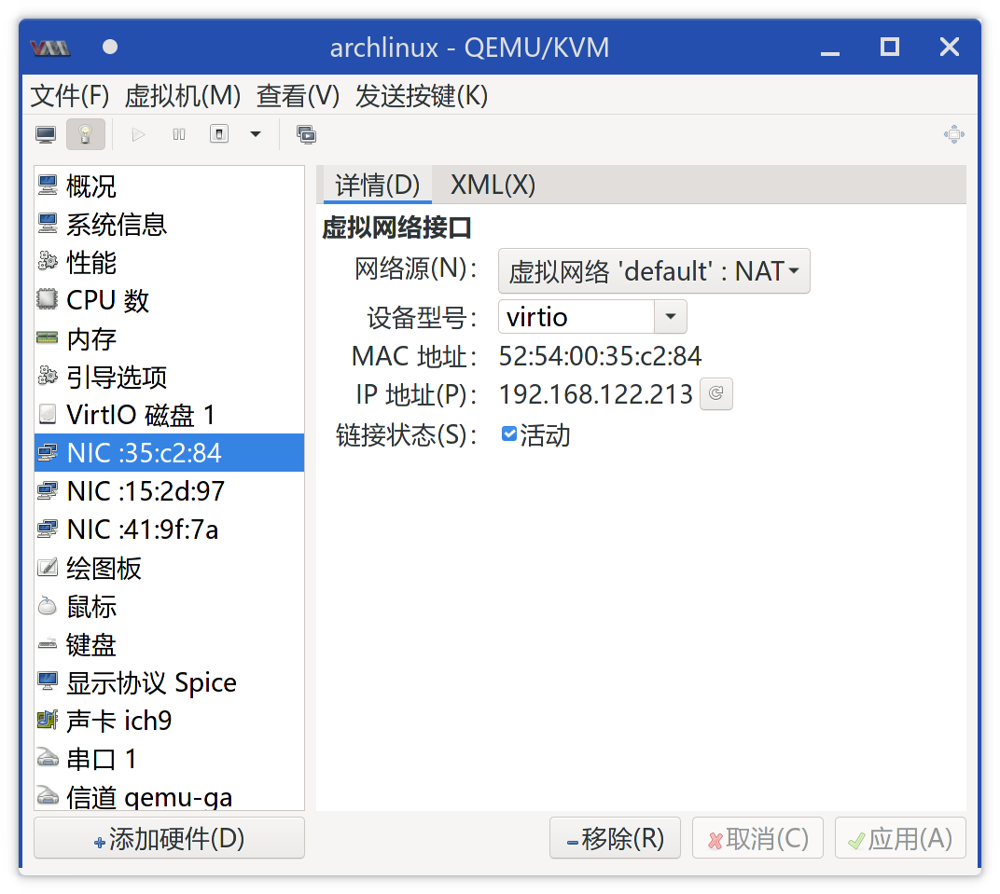

网卡信息如下：

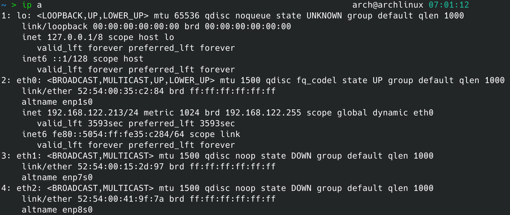

然后加载UIO模块。

```bash
sudo modprobe uio_pci_generic
```

然后绑定网卡。首先查看设备信息：

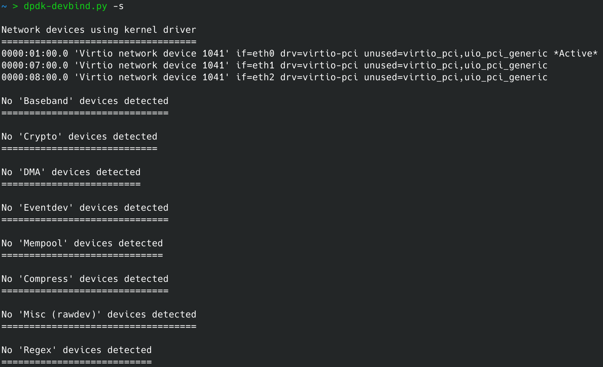

这里我选择eth1网卡进行绑定。

```bash
sudo dpdk-devbind.py -b uio_pci_generic 07:00.0
```

绑定完成后再次查看信息，发现绑定成功。

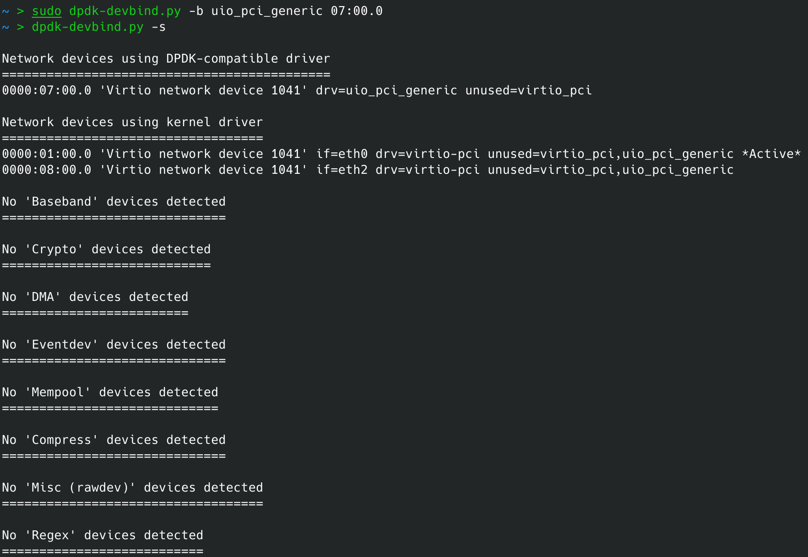

#### 编译并测试Helloworld样例程序

```bash
cd ./dpdk-21.11/examples/helloworld
make
cd build
sudo ./helloworld
```

能够输出正常结果，说明安装成功。

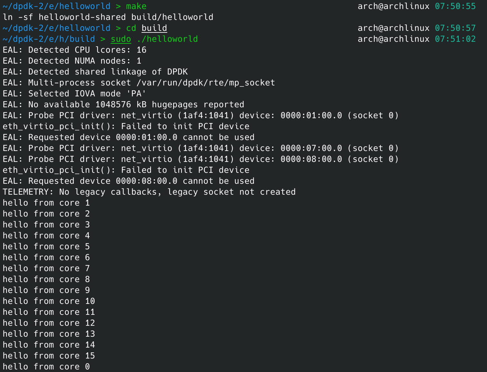

## 编译安装l2fwd和pktgen-dpdk

> (3) Compile and run DPDK sample application l2fwd on VM2, then compile and run pktgen-dpdk on VM1.  pkgen-dpdk will record the size of the packages VM1 sends and the amount of packages received from VM2,  while l2fwd just send back the packages it received from VM1.

作业要求在VM1上运行pktgen-dpdk，在VM2上运行l2fwd。这里我选择在一个虚拟机上安装这两个软件，再将其复制得到另一个虚拟机。

### l2fwd[^4]

l2fwd在编译安装DPDK时已经一同安装，这里我们测试它的运行。

```
cd ./dpdk-21.11/build/examples
sudo ./dpdk-l2fwd -c 0x1 -n 4 -- -p 0x1 -T 1
```

这里，`--` 前的参数是EAL（环境抽象层）参数，`--` 后的参数是该应用本身的参数。

具体来说，`-c 0x1` 以十六进制掩码的形式表示CPU的核心，这里代表启用0号核心；`-n 4`意思是设置4个内存通道。`-p 0x1` 以十六进制掩码的形式表示端口号，这里代表配置0号端口；`-T 1` 代表每过1s刷新一次结果。一段时间后：

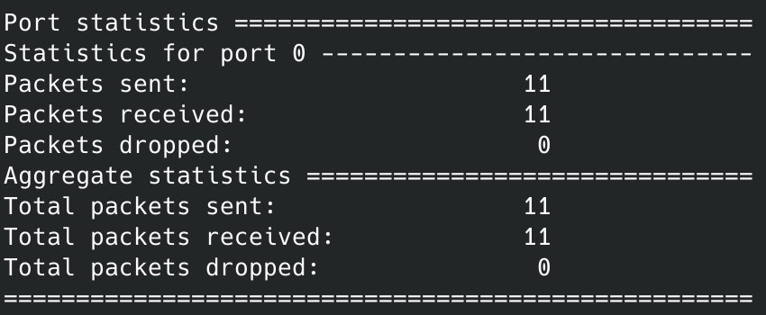

### pktgen-dpdk[^5]

#### 编译安装

首先下载最新版本pktgen-dpdk源代码并解压。

```bash
wget https://git.dpdk.org/apps/pktgen-dpdk/snapshot/pktgen-dpdk-pktgen-21.11.0.tar.xz
tar xf pktgen-dpdk-pktgen-21.11.0.tar.xz
```

然后编译安装，方法与DPDK相同。

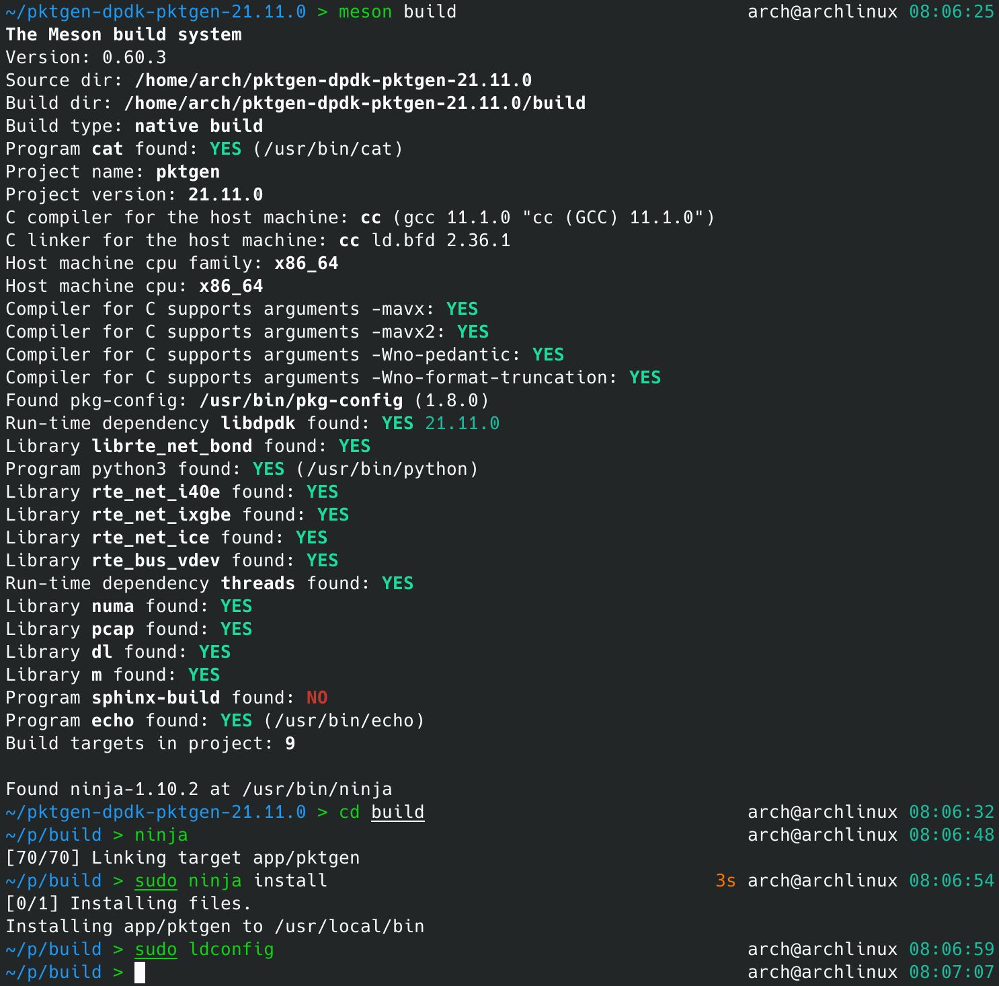

#### 测试运行

```bash
Cd ./pktgen-dpdk-pktgen-21.11.0/build/app
sudo ./pktgen -c 0x3 -n 4 -- -m "[1].0" 
```

这里和l2fwd类似，`--` 前的参数是EAL（环境抽象层）参数，`--` 后的参数是该应用本身的参数。

具体来说，`-c 0x3` 以十六进制掩码的形式表示CPU的核心，这里代表启用0号和1号核心；`-n 4`意思是设置4个内存通道。`-m "[1].0"` 表示1号核心处理0号端口的收发包。特别要注意的是，pktgen-dpdk会使用一个核心作为initial lcore（上述命令中是0号核心），因此至少要启用两个CPU核心，并且处理端口的核心不能为initial lcore，否则报错如下：

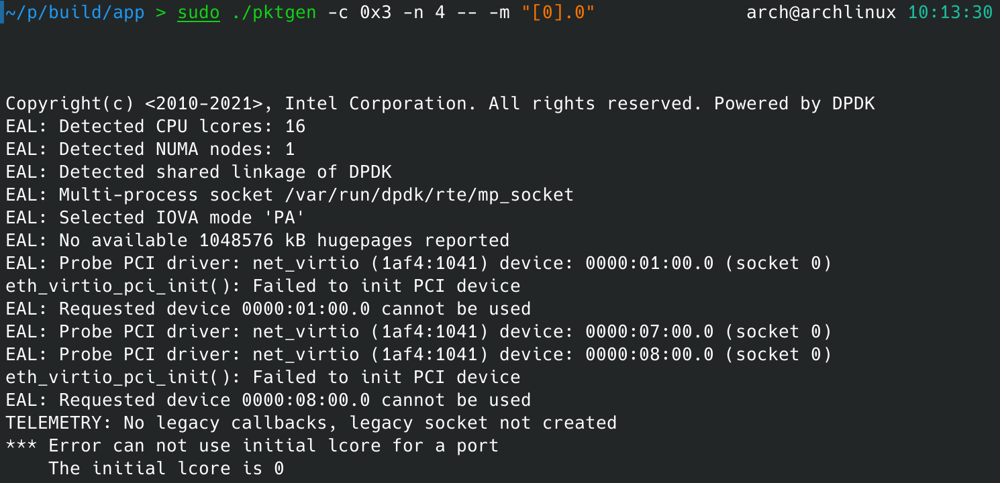

启动pktgen-dpdk如下，说明安装成功。

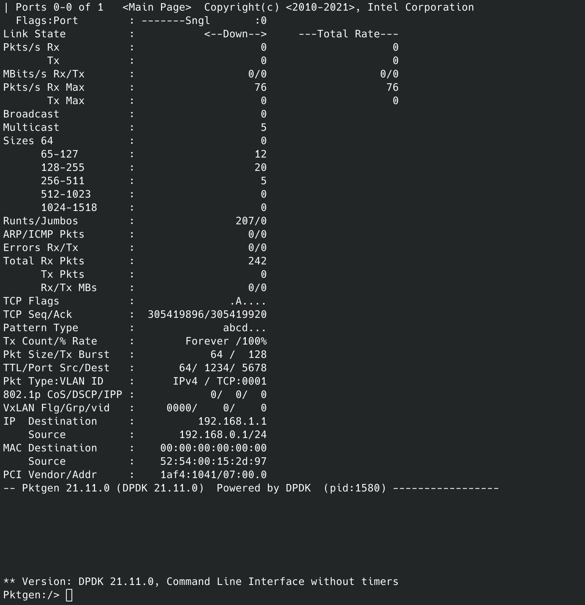

## 测试

> (4) Evaluate DPDK’s performance of L2 forwarding.

### 克隆并配置两个虚拟机[^7]

首先复制虚拟机并配置IP地址如下：

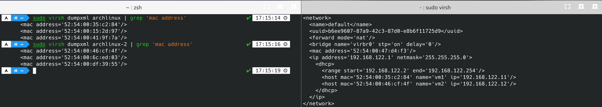

然后重新创建 `default` 网络。

```bash
sudo virsh net-destroy default
sudo virsh  net-start default
```

然后开启两个虚拟机，发现IP地址配置成功。

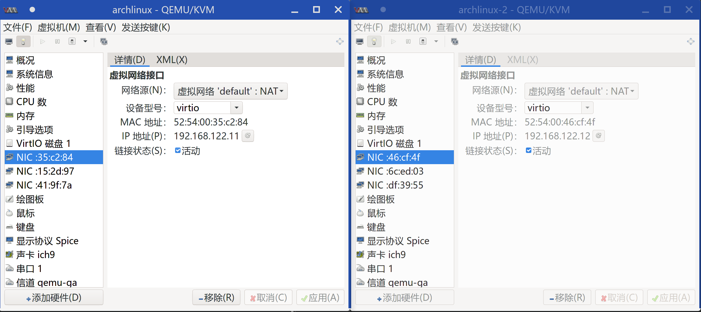

### 测试

#### 测试过程

在VM1上启用pktgen-dpdk后，输入以下命令进行发包。第一行设置了端口0对应的目的地MAC地址（为VM2中绑定到DPDK上的网卡的MAC地址）。第二行开始发包。

```bash
set 0 dst mac 52:54:00:6c:ed:03
start 0
```

运行效果如下。可以看到发送速率大约为2.5MPkts/s，但接收速率基本上为0。

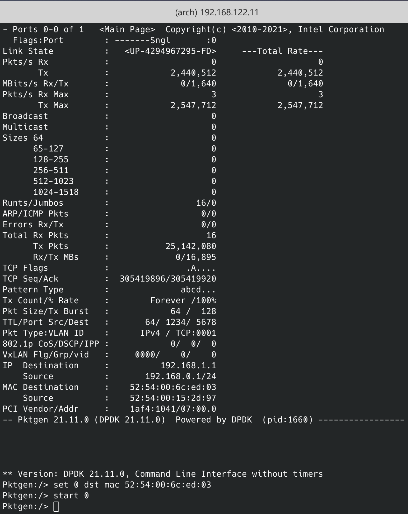

在VM2上开启l2fwd后，由于l2fwd会把收到的包转发回来，VM1上观察到接收速率为0.3MPkts/s左右，发送速率降低到1.5MPkts/s左右：

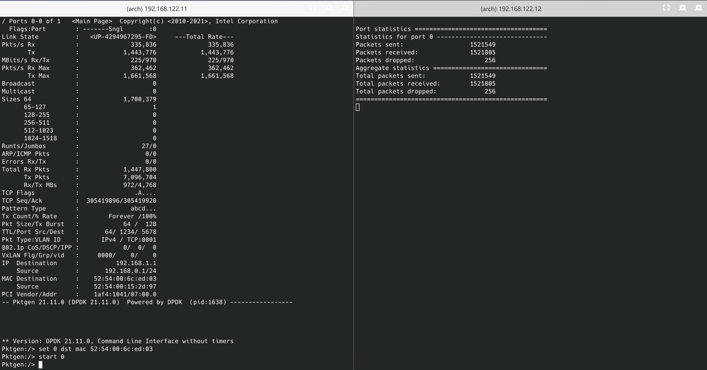

#### 统计分析

这里我统计l2fwd和pktgen-dpdk在运行了一分钟之后的结果并进行分析。截图如下：


1. VM2上，l2fwd在一分钟内接收到20289050个包，成功转发出去20288314个，丢包73个，丢包率约为$3.6\times 10^{-6}$。
2. VM1上总共发出了92653248个包，但VM2上只接受到20289050个包，说明在传输过程中丢包率较高。可能的原因是，由于发送数据包的速率太快，超出了缓冲区队列的大小，引起丢包。VM2上总共发出了20288314个包，VM1上接受到20031962个包，说明VM2向VM1发送数据包的过程中，丢包率较低。
3. VM1上观察到接收速率为0.3MPkts/s左右，发送速率降低到1.5MPkts/s左右。又因为VM1向VM2发送数据包的过程中丢包率较高，VM2向VM1发送数据包的过程中丢包率较低，说明性能瓶颈很有可能在于VM2上的l2fwd。

## 总结

在本次实验中，我通过测试DPDK的性能，对计算机网络中数据链路层的知识有了更深刻的认识。

## 致谢

感谢我的同学刘梓睿和杨钦崴在本次实验中对我的帮助。

[^1]:https://doc.dpdk.org/guides/linux_gsg/build_dpdk.html
[^2]:https://doc.dpdk.org/guides/linux_gsg/linux_drivers.html
[^3]:https://github.com/openvswitch/ovs-issues/issues/191
[^4]:https://doc.dpdk.org/guides/sample_app_ug/l2_forward_real_virtual.html
[^5]:https://github.com/pktgen/Pktgen-DPDK/blob/dev/INSTALL.md
[^6]:https://pktgen-dpdk.readthedocs.io/en/latest/running.html
[^7]:https://huataihuang.gitbooks.io/cloud-atlas/content/virtual/kvm/startup/in_action/kvm_libvirt_static_ip_for_dhcp_and_port_forwarding.html
